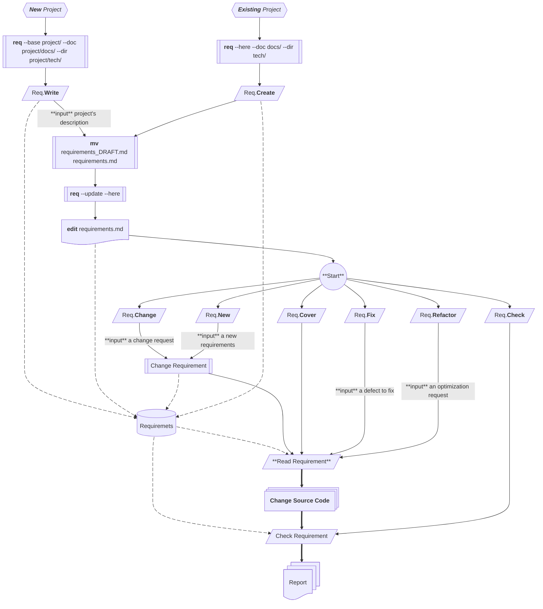

# Flowchart

## Use Mermaid Live Editors:
- [https://mermaid.live/](https://mermaid.live/)
- [https://mermaid.ai/play](https://mermaid.ai/play) (B&W version)

## Source Code

```mermaid
flowchart TD
    %% Flowchart
    START((**Start**))
    NP@{ shape: hex, label: "***New*** *Project*"}
    EP@{ shape: hex, label: "***Existing*** *Project*"}
    CMDNP@{ shape: subproc, label: "**req** --base project/ --doc project/docs/ --dir project/tech/" }
    CMDEP@{ shape: subproc, label: "**req** --here --doc docs/ --dir tech/" }
    CMDUPDATE@{ shape: subproc, label: "**req** --update --here" }
    EDIT@{ shape: doc, label: "**edit** requirements.md" }
    REQ[(Requiremets)]
    CHANGE@{ shape: lean-r, label: "Req.**Change**"}
    CHECK@{ shape: lean-r, label: "Req.**Check**"}
    COVER@{ shape: lean-r, label: "Req.**Cover**"}
    FIX@{ shape: lean-r, label: "Req.**Fix**"}
    NEW@{ shape: lean-r, label: "Req.**New**"}
    REFACTOR@{ shape: lean-r, label: "Req.**Refactor**"}
    WRITE@{ shape: lean-r, label: "Req.**Write**"}
    CREATE@{ shape: lean-r, label: "Req.**Create**"}
    RENAME@{ shape: subproc, label: "**mv** requirements_DRAFT.md requirements.md" }
    REQ_CHANGE[[Change Requirement]]
    REQ_READ[/**Read Requirement**/]
    REQ_CHECK[/Check Requirement/]
    CODE_CHANGE@{ shape: procs, label: "**Change Source Code**"}
    REPORT@{ shape: docs, label: "Report"}

    %% New Project
    NP --> CMDNP
    CMDNP --> WRITE
    WRITE -- **input** project's description --> RENAME

    %% Existing Project
    EP --> CMDEP
    CMDEP --> CREATE
    CREATE--> RENAME
    RENAME --> CMDUPDATE
    CMDUPDATE --> EDIT
    EDIT --> START

    %% Requirements
    REQ e1@-.-> REQ_READ
    e1@{ animate: true }
    REQ e2@-.-> REQ_CHECK
    e2@{ animate: true }
    WRITE e3@-.-> REQ
    e3@{ animate: true }
    EDIT e4@-.-> REQ
    e4@{ animate: true }
    REQ_CHANGE e5@-.-> REQ
    e5@{ animate: true }
    CREATE e6@-.-> REQ
    e6@{ animate: true }

    %% Change
    START --> CHANGE
    CHANGE -- **input** a change request --> REQ_CHANGE
    REQ_CHANGE --> REQ_READ
    REQ_READ ==> CODE_CHANGE
    CODE_CHANGE ==> REQ_CHECK
    REQ_CHECK ==> REPORT
    %% REPORT --> START

    %% Check
    START --> CHECK
    CHECK ------> REQ_CHECK

    %% Cover
    START --> COVER
    COVER ----> REQ_READ

    %% Fix
    START --> FIX
    FIX -- **input** a defect to fix ----> REQ_READ

    %% Refactor
    START --> REFACTOR
    REFACTOR -- **input** an optimization request ----> REQ_READ

    %% New
    START --> NEW
    NEW -- **input** a new requirements--> REQ_CHANGE 
```